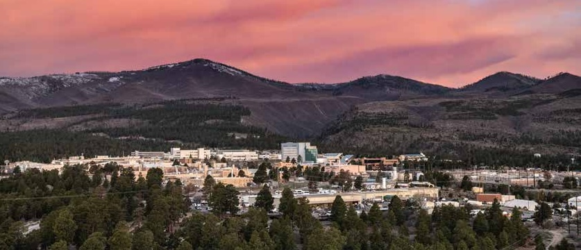

---
hide:
  - navigation
  - toc
title: Los Alamos Computational Condensed Matter Summer School 2025
#template: home.html
---

# Los Alamos Computational Condensed Matter Summer School 2025 - Closing the Loop Between Experiment and Theory

  

**Los Alamos National Laboratory (LANL) will host the 2025 Los Alamos Computational Condensed Matter Summer School in Los Alamos, New Mexico on June 16-27, 2025.**

<!--The 2025 Los Alamos Computational Condensed Matter Summer School will expose students to modern and emerging theoretical, computational, and experimental techniques, and gain hands-on training in applying these approaches to current problems in the physical sciences and engineering.-->

## Overview
An increasing number of modern applications of physics, chemistry, materials science, and engineering rely on materials that exhibit manifestations of quantum physics. These quantum materials hold the key not only to new advanced technologies but also to raise fundamental questions about the microscopic physical world. To understand such systems, it has become increasingly necessary to employ a combination of high-resolution spectroscopies and theoretical modeling of the interplay of spin, charge, orbital, and lattice degrees of freedom in parallel to disentangle the rich tapestry of complex properties. 

This two-week summer school aims to expose students to modern and emerging theoretical and experimental techniques, as well as their application to problems in the physical sciences and engineering. Lectures will be pedagogical, covering (i) the background quantum mechanical and many-body theory necessary to understand modern computational methods, (ii) introduce emerging material informatics and ML/AI tools, and (iii) in-depth tutorials on key experimental techniques, along with their theoretical underpinnings. Topics will be presented in a logical sequence to ensure all students are on the same footing. Extensive hands-on training using open-source codes will be an integral part of the school. Additionally, the students will visit three user facilities to show how the techniques learned in the classroom translate to real scientific problems. 

This school is open to both theoretical and experimental science students who have completed at least one year of graduate work and are familiar with advanced quantum mechanics and statistical mechanics. Each student will have the opportunity to present their work to encourage in-depth discussion. Questions are encouraged, free time and hands-on sessions give ample time for students to interact with Faculty and with each other. This school will help train the next generation of researchers to use and develop these tools and methods in their own research programs. 

Travel, room, and board will be provided.

## Important Dates:
|       | Date |
|-------|------|
| Application open | November 15, 2024 |
| Application deadline | <s>January 1, 2025</s> (**extended to February 1, 2025**)|
| Results announced | <s>January 15, 2025</s> February 15, 2025 <i style="text-color:Tomato;">Notice of acceptance have been sent.</i>|
| Registration | <s>January 31, 2025</s> February 28, 2025 |
| LANL onboarding package deadline | <s>March 7, 2025</s> |
| Travel Itinerary Submitted | May 30, 2025 |
| Poster Title and Lightning Slide Submitted | June 1, 2025 |
| Arrival and Check-in | June 15, 2025 |
| LACCM Summer School | June 16-27, 2025 |
| Departure | June 28, 2025 |

## Topics Covered
* Foundations of Density Functional Theory and Electronic Structure
* The Effect of Electronic Correlations and Many-Body Theory
* Numerical Approach to the Many-Body Problem
* Background of Modern Experimental Spectroscopies
* Material Informatics and ML/AI for Quantum Materials

## How to Apply: [Here](apply.md)

## Organizers
* Christopher Lane, Theoretical Division, Los Alamos
* Roxanne Tutchton, Theoretical Division, Los Alamos
* Elizabeth Peterson, Theoretical Division, Los Alamos
* Jianxin Zhu, Theoretical Division, Los Alamos
* Ying Wai Li, Computer, Computational, and Statistical Sciences Division, Los Alamos
* Johanna Palmstrom, National High Magnetic Field Laboratory: Pulsed Field Facility
* Yue Huang, Center for Integrated Nanotechnologies

## Sponsors
* [Institute for Materials Science (IMS)](https://collaboration.lanl.gov/nsec/institute-for-materials-science/), LANL
* [Center for Nonlinear Studies (CNLS)](https://cnls.lanl.gov/External/), LANL
* [Center for Integrated Nanotechnology (CINT)](https://cint.lanl.gov/), LANL
* [Institutional Computing](https://www.lanl.gov/org/ddste/aldsc/hpc/index.php), LANL
* [International Institute for Complex Adaptive Matter (ICAM-I2CAM)](https://www.icam-i2cam.org/)

